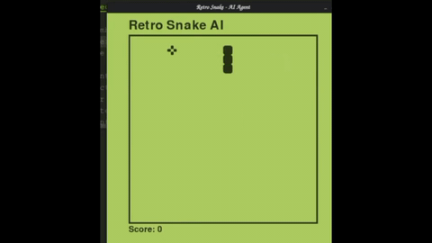

# Retro Snake AI — Deep Q-Learning (DQN)

A classic Snake game powered by **Deep Reinforcement Learning**. The agent learns to navigate the board, find food, avoid collisions, and improve its performance through repeated gameplay.

Built with **Python, PyTorch, Pygame, NumPy, and Matplotlib**.

---

## Gameplay

The trained AI playing Snake in real time:

<video src="snake.mp4" controls="controls" autoplay="autoplay" loop="loop" muted="muted" width="100%">
  Your browser does not support the video tag.
</video>



### Game Graphics


---

## Features

* **Deep Q-Learning (DQN)** — Neural network-based decision making using PyTorch.
* **16-Feature State Representation** — Includes danger detection, movement direction, food position, body length, and tail position.
* **Tail Awareness** — The agent considers the relative position of its tail when making decisions.
* **Reward Shaping** — Encourages the snake to move toward food while discouraging inefficient movement.
* **Experience Replay** — Stores previous experiences and trains from batches of past gameplay.
* **Short-Term & Long-Term Training** — Learns from individual moves as well as completed games.
* **Model Persistence** — Saves the trained neural network so training can continue between sessions.
* **Automatic Checkpointing** — Updates the saved model when a new record score is achieved.
* **Live Training Metrics** — Matplotlib tracks score progression and running average score.

---

## Project Structure

```text
.
├── agent.py              # AI agent and training loop
├── snake.py              # Snake game environment
├── model.py              # Neural network and Q-learning trainer
├── helper.py             # Training visualization
├── snake.png             # Gameplay screenshot
├── snake.gif             # Gameplay animation
├── snake.mp4             # Gameplay recording
└── model/
    └── model.pth         # Saved neural network
