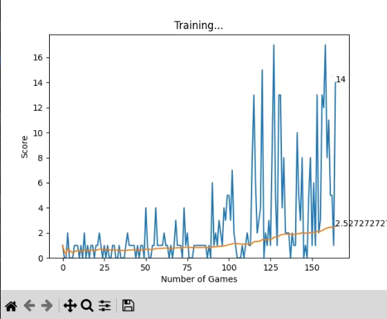

# Retro Snake AI — Deep Q-Learning (DQN)

A classic Snake game powered by **Deep Reinforcement Learning**. The agent learns to navigate the board, find food, avoid collisions, and improve its performance through repeated gameplay.

Built with **Python, PyTorch, Pygame, NumPy, and Matplotlib**.

---

## Gameplay

The trained AI playing Snake in real time:

<video src="snake.gif" controls width="800"></video>

> If GitHub does not render the MP4 directly in your README, you can also convert the gameplay recording to a GIF and embed that instead.

### Game Graphics



---

## Features

* **Deep Q-Learning (DQN)** — Neural network-based decision making using PyTorch.
* **16-Feature State Representation** — Includes danger detection, movement direction, food position, body length, and tail position.
* **Tail Awareness** — The agent considers the relative position of its tail when making decisions.
* **Reward Shaping** — Encourages the snake to move toward food while discouraging inefficient movement.
* **Experience Replay** — Stores previous experiences and trains from batches of past gameplay.
* **Short-Term & Long-Term Training** — Learns from individual moves as well as completed games.
* **Model Persistence** — Saves the trained neural network so training can continue between sessions.
* **Automatic Checkpointing** — Updates the saved model when a new record score is achieved.
* **Live Training Metrics** — Matplotlib tracks score progression and running average score.

---

## Project Structure

```text
.
├── agent.py              # AI agent and training loop
├── snake.py              # Snake game environment
├── model.py              # Neural network and Q-learning trainer
├── helper.py             # Training visualization
├── snake.png             # Gameplay screenshot
├── snake.mp4             # Gameplay recording
└── model/
    └── model.pth         # Saved neural network
```

---

## Installation

### Requirements

* Python 3.8+
* PyTorch
* Pygame
* NumPy
* Matplotlib

Install the dependencies:

```bash
pip install pygame torch numpy matplotlib
```

---

## Run the AI

Start the training environment with:

```bash
python agent.py
```

If a trained model already exists, the agent can load it and continue improving rather than starting from an untrained network.

---

## How the AI Learns

Each game follows a reinforcement-learning cycle:

```text
       ┌──────────────┐
       │  Observe     │
       │    State     │
       └──────┬───────┘
              │
              ▼
       ┌──────────────┐
       │ Choose Action│
       │  ε-Greedy    │
       └──────┬───────┘
              │
              ▼
       ┌──────────────┐
       │ Play Move    │
       └──────┬───────┘
              │
              ▼
       ┌──────────────┐
       │ Get Reward   │
       │ + New State  │
       └──────┬───────┘
              │
              ▼
       ┌──────────────┐
       │ Train Neural │
       │    Network   │
       └──────┬───────┘
              │
              └──────────► Repeat
```

The agent gradually learns which actions produce higher long-term rewards.

---

## State Representation

The AI receives a **16-feature state vector** describing the current situation.

| Feature Group          | Features |
| ---------------------- | -------: |
| Immediate danger       |        3 |
| Current direction      |        4 |
| Food position          |        4 |
| Normalized body length |        1 |
| Tail position          |        4 |
| **Total**              |   **16** |

### State Information

**Danger detection**

* Collision directly ahead
* Collision to the right
* Collision to the left

**Movement direction**

* Moving left
* Moving right
* Moving up
* Moving down

**Food position**

* Food is left of the head
* Food is right of the head
* Food is above the head
* Food is below the head

**Body information**

* Normalized snake length
* Tail left/right relationship
* Tail above/below relationship

This gives the network information about both **immediate survival** and **longer-term positioning**.

---

## Neural Network

The Q-network uses a fully connected architecture:

```text
Input Layer
16 features
     │
     ▼
┌──────────────┐
│  Linear 256  │
│     ReLU     │
└──────┬───────┘
       │
       ▼
┌──────────────┐
│  Linear 128  │
│     ReLU     │
└──────┬───────┘
       │
       ▼
┌──────────────┐
│   3 Outputs  │
└──────────────┘
       │
       ▼
[Straight, Right, Left]
```

The network outputs a **Q-value for each possible action**. The action with the highest predicted value is selected when the agent is exploiting what it has learned.

---

## Available Actions

The agent operates using three relative actions:

```text
[1, 0, 0] → Straight
[0, 1, 0] → Turn Right
[0, 0, 1] → Turn Left
```

Using relative actions allows the same decision system to work regardless of the snake's current orientation.

---

## Reward Structure

The environment uses reward shaping to guide learning.

| Event               | Reward |
| ------------------- | -----: |
| Eat food            |    +10 |
| Move closer to food |   +0.1 |
| Move away from food |  -0.25 |
| Collision / timeout |    -10 |

The objective is not simply to survive. The agent must learn to **survive while efficiently reaching food**.

---

## Experience Replay

The agent stores previous experiences in a replay buffer:

```text
(state)
   ↓
(action)
   ↓
(reward)
   ↓
(next_state)
   ↓
(done)
```

During long-term training, the agent samples experiences from this memory and trains on them.

This helps reduce the correlation between consecutive moves and allows useful experiences to be learned from multiple times.

---

## Model Persistence

Training can continue across multiple sessions.

The model is saved as:

```text
model/model.pth
```

A saved model allows the agent to retain what it has learned instead of starting from random weights every time.

The training workflow is therefore:

```text
Previous Training
       │
       ▼
 Load Model
       │
       ▼
 Continue Training
       │
       ▼
 Improve Performance
       │
       ▼
 Save Improved Model
```

---

## Training Metrics

During training, the project uses Matplotlib to visualize:

* Score per game
* Running mean score
* Overall training progression

Example:

```text
Score
  │
  │                 ╭──────
  │            ╭────╯
  │       ╭────╯
  │  ╭────╯
  │──╯
  └──────────────────────────► Games
```

As training progresses, the goal is for the agent's average performance to improve.

---

## Customization

### Game Speed

Adjust the game speed in `snake.py`:

```python
SPEED = 60
```

Higher values make training and gameplay faster.

### Exploration

The agent uses an ε-greedy strategy:

```python
self.epsilon = max(1, 80 - self.n_games)
```

Early training encourages exploration by trying random actions.

As the number of games increases, exploration decreases and the agent increasingly relies on its learned policy.

---

## Technologies

| Technology | Purpose                         |
| ---------- | ------------------------------- |
| Python     | Core programming language       |
| PyTorch    | Neural network and DQN training |
| Pygame     | Snake game environment          |
| NumPy      | State representation            |
| Matplotlib | Training visualization          |

---

## Learning Objectives

This project was built to explore practical applications of:

* Reinforcement Learning
* Deep Q-Learning
* Neural Networks
* Experience Replay
* Reward Engineering
* Exploration vs. Exploitation
* Model Checkpointing
* Persistent AI Training
* Game AI

Rather than simply implementing a pre-trained model, the goal is to understand how an agent can **learn through interaction with an environment**.

---

## Roadmap

* [x] Build Snake environment
* [x] Implement DQN agent
* [x] Implement state representation
* [x] Implement reward system
* [x] Implement experience replay
* [x] Add model persistence
* [x] Add live training visualization
* [x] Record gameplay
* [ ] Improve reward shaping
* [ ] Experiment with larger state representations
* [ ] Compare different network architectures
* [ ] Add evaluation mode
* [ ] Benchmark trained models

---

## Author

**Soala Amachree**

Mechatronics Engineering Student • Systems & Software Developer • AI & Robotics Enthusiast

Building projects across **AI, robotics, systems programming, and software engineering**.
